# PORTAFOLIO

## Dependencias y herramientas

<!-- 

 -->

Portafolio con todos los proyectos hechos durante el programa intensivo de javascript, son tres con diseños distintos. Uno más formal y normal, el otro es personalizado y uno más entretenido.

## Portafolio Formal y Normal

colores: #F2F2F2, #03A696, #027367, #014039, #000D0B.
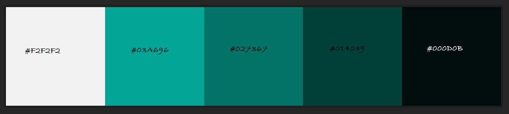

Diseño:
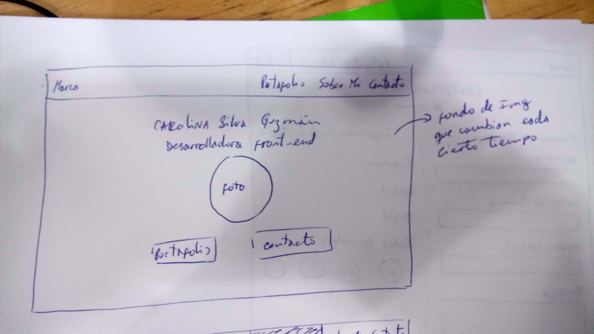
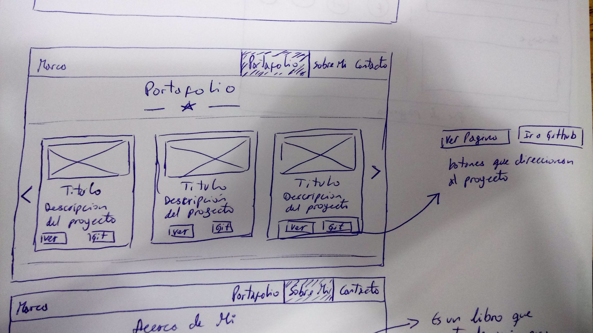
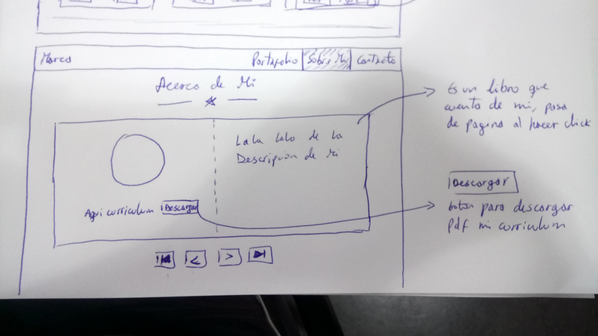
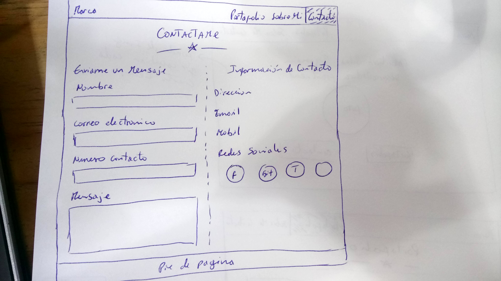

## Portafolio Personalizado

colores: #0B0B0D, #80848C, #B7B2AE, #D9A441, #D999543.
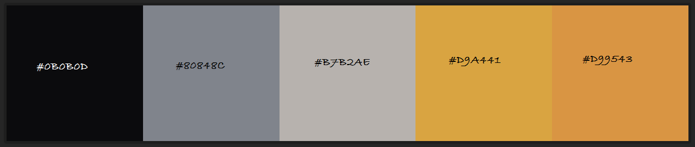

Diseño:

## Juego Portafolio

colores: aun no definidos.

Diseño:
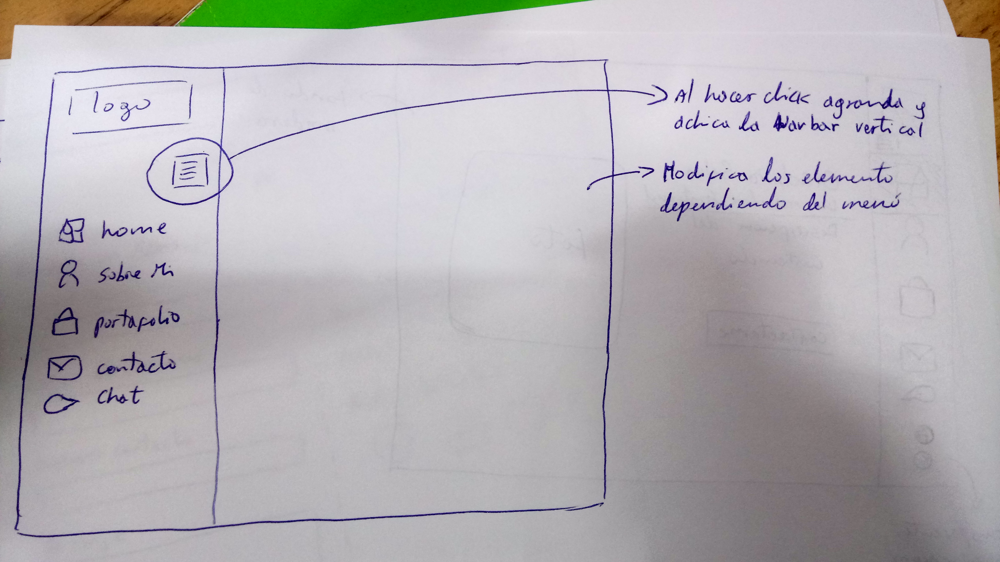
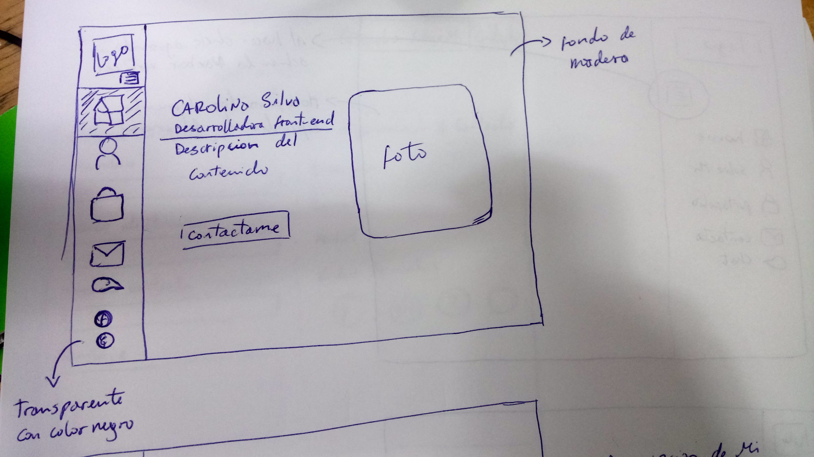
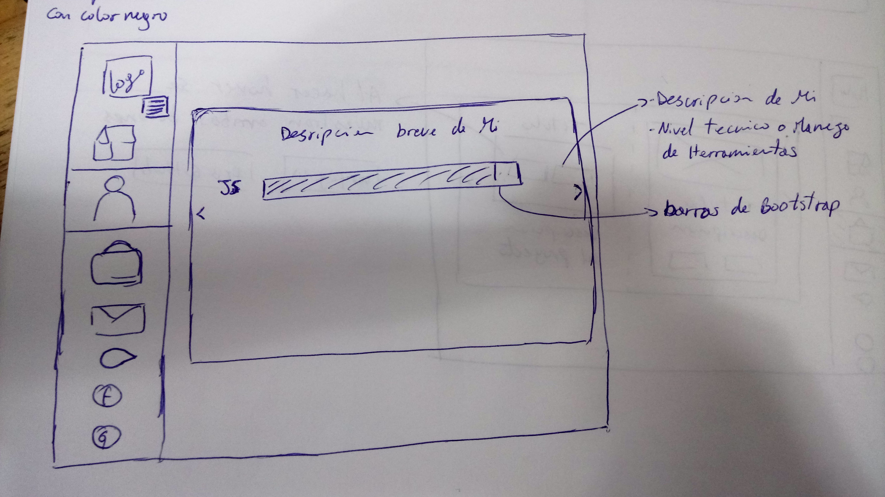
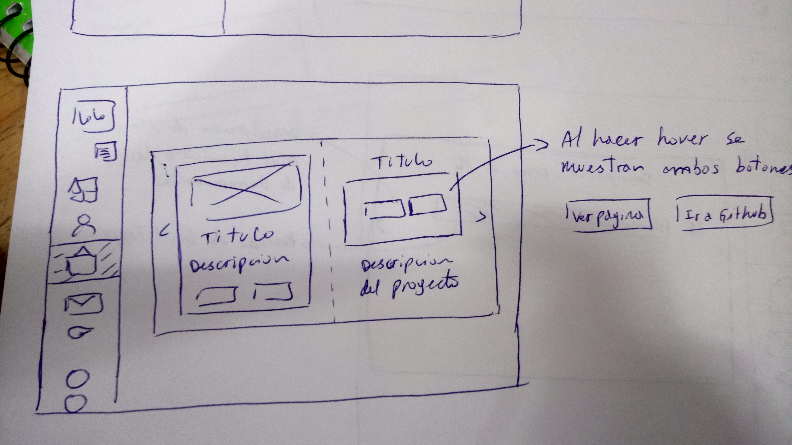
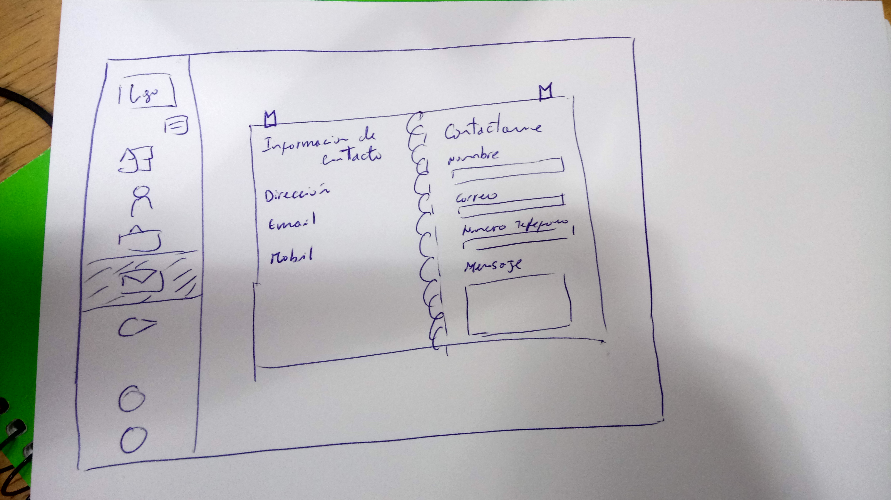

